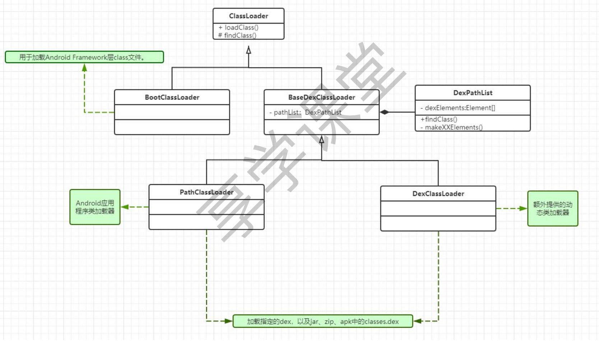
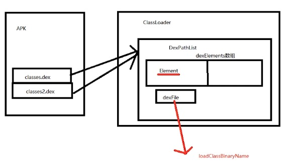

### 类加载

#### 类加载器关系图

- 比如Activity类在系统中，所以是通过BootClassLoader加载，而一般我们用到的AppCompatActivity，属于官方第三方库中的类，则通过PathClassLoader加载。
- 双亲委派机制保证能通过上层类加载器加载就不会使用下层类加载器，主要出于避免重复加载与安全性的方面来考虑。
- `ClassLoader`的`loadClass`逻辑可以看一下，主要是缓存逻辑和双亲委派逻辑，还有`findClass`方法。

##### 热修复原理（类tinker方案
- 制作补丁文件dex插入到elements数组的最前面，类没有被加载时会优先加载，需要重启。
- 1.获取当前应用的PathClassLoader
- 2.反射获取到DexPathList属性对象pathList
- 3.反射修改pathList的dexElements
	- 3.1 把补丁包patch.dex转化为Element[]（patch）
	- 3.2 获得pathList的dexElements属性(old)
	- 3.3 patch+old合并，并反射赋值给pathList的dexElements

##### 本Demo使用说明（小米10亲测可用）
- BugTest类里面的testCrash模拟一个有bug点，装到手机上运行后，点击按钮必crash
- 修改BugTest中有问题的地方，重新assemble，在build/tmp/kotlin-classes（如果是java写的类则在build/intermediates/javac）
    下找到对应类的class文件（kt可能具体实现会/* compiled code */无法显示，可以无视，可以直接看生成的补丁包dex,用show bytecode插件查看）
- 需要在build文件夹下的com.xx.xx(包名)上级目录执行dx --dex --output=patch.dex com/xun/loader/ButTest.class(先配好dx的环境变量)，生成对应的patch文件
- patch.dex放在对应的目录（建议私有目录），MyApplication里传对应的路径
- 重启验证是否修复成功