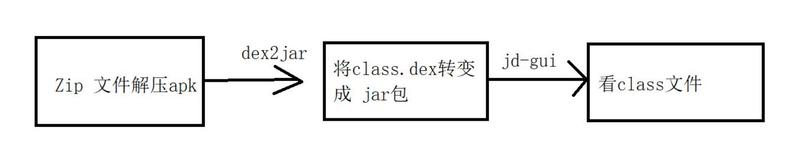
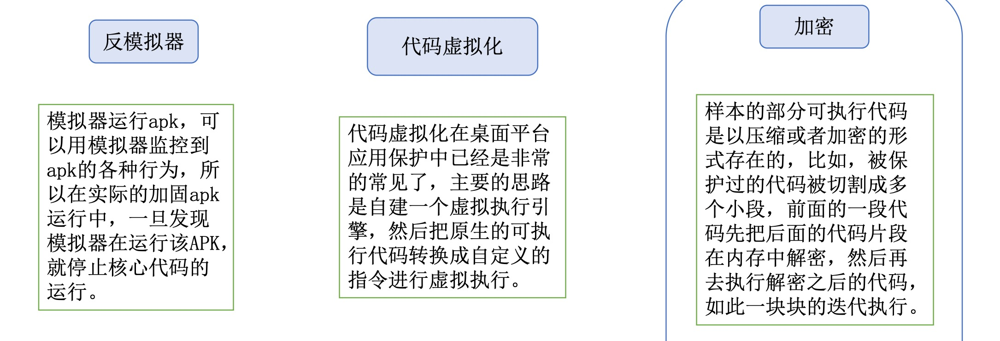
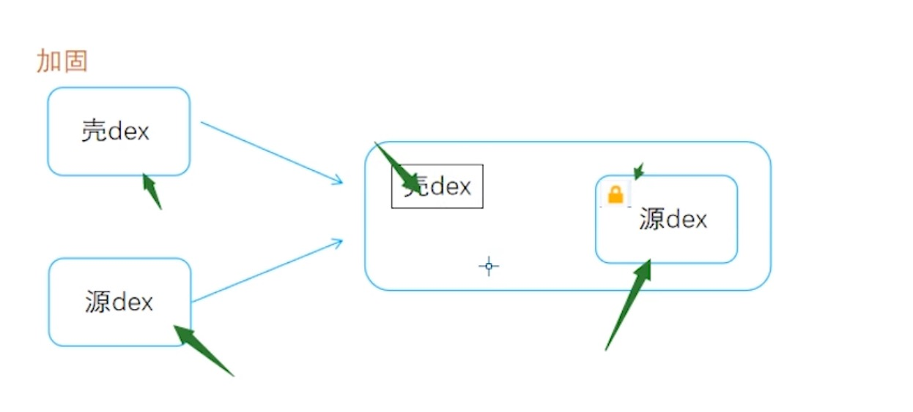
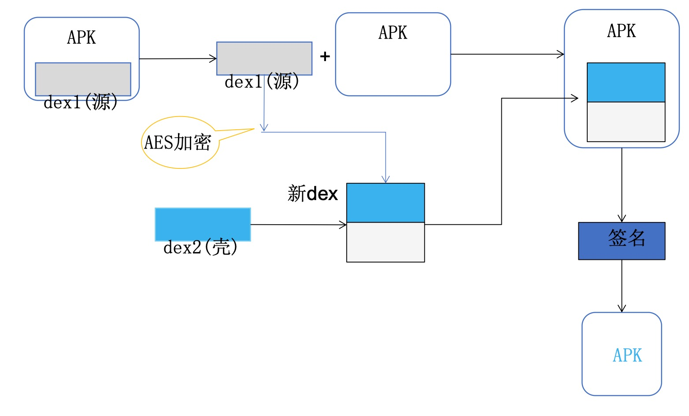
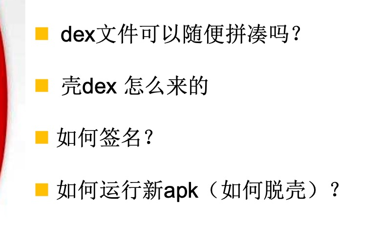
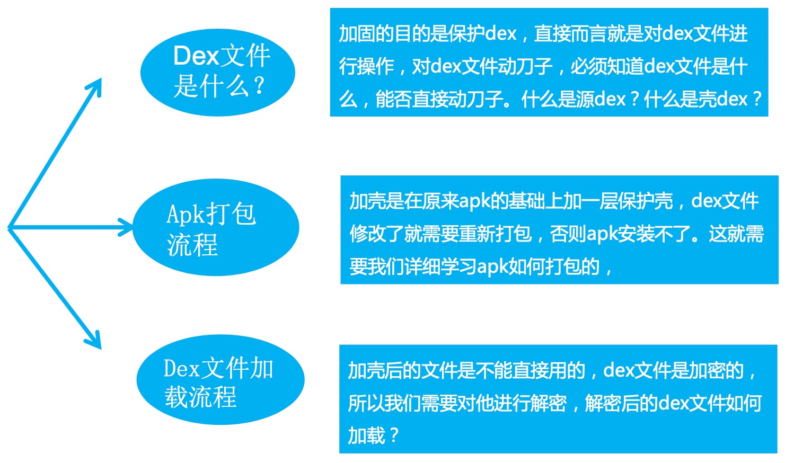
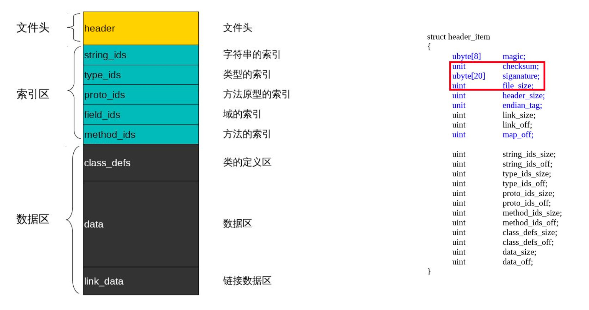
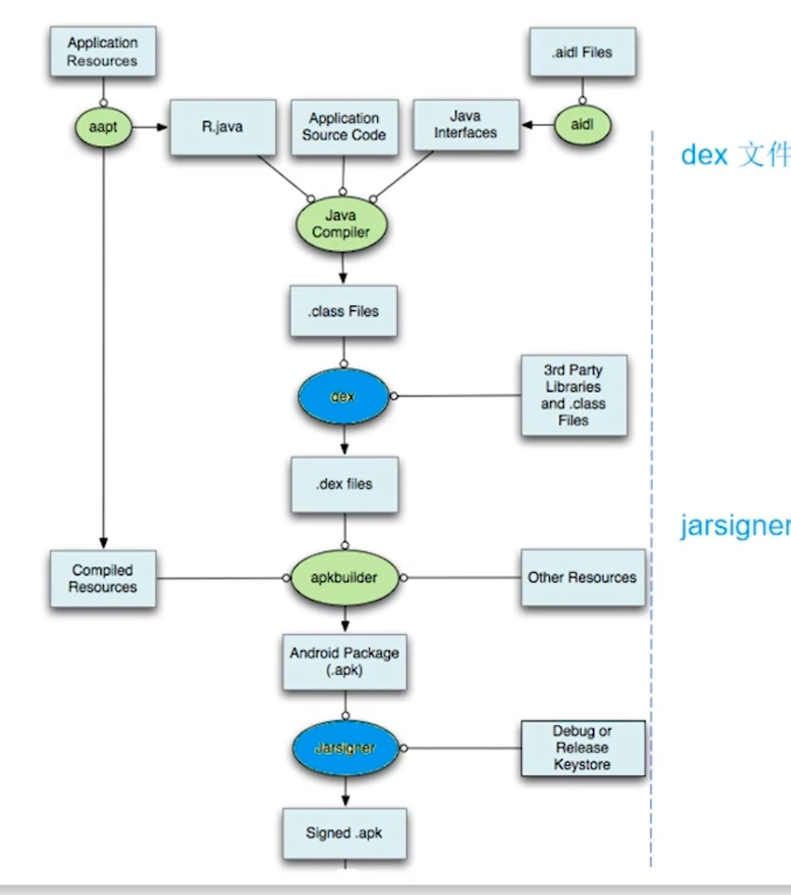

## File IO 项目实战—dex文件改造加固
> 摘要：本文描述了apk加固的一个方案，并提供了一个可运行的相关代码，目前来看至少还有几个方面不太完善与深入：
1.application目前是在mylibrary里，至少需要通过某种方式可以能让上层注入
2.加密与解密的流程并没有深入了解，需要的时候再看，加密流程也可以变成py脚本
3.该方案是把整个源dex进行AES加密，颗粒度并不高，性能层面上每次运行的损耗未知
内容来自享学第三期

### APK文件与反编译

以上描述了常规反编译流程
### 常见加固手段和方案

### APK的加固方案原理

把源dex和壳dex通过文件IO的方式放在一个apk里，并先加载壳dex，源dex是加密过的，运行壳dex的时候会动态地去解密加密过的源dex，在加载进来，达到解密的效果。

需要解决的几个问题

### dex文件结构

### 复习下APK打包流程
相关工具可以在sdk目录下build-tools里找到

#### APK加固项目实战

另一个实例代码地址：
https://github.com/same4869/Learn-Android-from-zero/tree/main/File-IO-%E9%A1%B9%E7%9B%AE%E5%AE%9E%E6%88%98%E2%80%94dex%E6%96%87%E4%BB%B6%E6%94%B9%E9%80%A0

↑demo说明：
`ProtectApp`里面的app模块是原工程，mylibrary模块是壳工程，mylibrary会打包成aar作为app模块的依赖，承载了applicaiton入口（真正的开发中可能需要使用hook或者其他方式，不可能把application完全写在lib中）
applicaiton所以会在aar里面，aar会转变成dex，这个dex不能被加密，运行时到application时，里面会进行对其他dex的解密并使用classload进行加载，从而达到解密（脱壳）的目的。

`ShellAddProject`是使用以上流程对apk,dex,aar进行解压，加密，二次签名等流程，使用java写的，也许也可用py会更加灵活点。`ShellProject2`是自己在mac上测试新建的，可以跑通。

使用：ProtectApp 项目生成对应的apk，mylibrary（解密模块） 生成对应的aar，放到ShellAddProject(JAVA工程，建议idea打开) 的source对应文件夹内，运行MyMain（注意dx，签名文件等工具的路径） ，之前遇到个坑见https://blog.csdn.net/u014657752/article/details/122864811

此工程说明：
app依赖decodelib，encode是一个java工程，myClass是入口类，首先分别把app和decodelib通过assemble成对应的apk和aar，放到encode的source文件夹中，运行myClass，会在result文件夹中生成目标apk。
说明：此工程因为使用的androidx，kt，新版agp等，导致有无法安装（10以上），闪退问题（找不到androidx中的类），属于初级半成品，仅提供思路用。